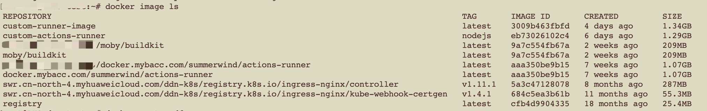
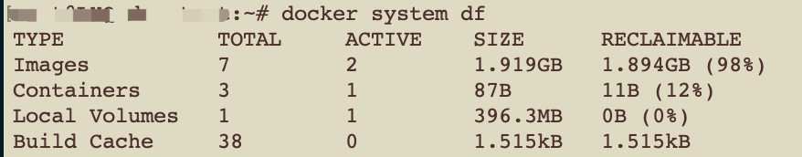
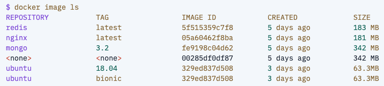
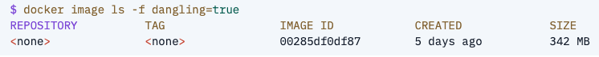

# Vue 3 + Vite

This template should help get you started developing with Vue 3 in Vite. The template uses Vue 3 `<script setup>` SFCs, check out the [script setup docs](https://v3.vuejs.org/api/sfc-script-setup.html#sfc-script-setup) to learn more.

## Recommended IDE Setup

- [VS Code](https://code.visualstudio.com/) + [Vue - Official](https://marketplace.visualstudio.com/items?itemName=Vue.volar) (previously Volar) and disable Vetur

# 目的：此项目是为了尝试在 Rancher 上部署而建

# 本地项目第一次 push github

1. github 新建同名项目
2. 本地项目 git init
3. git remote add origin git@github.com:XXXXX
4. git branch -M master
5. git add .
6. git commit -m 'first commit'
7. git push -u origin master

# github action 重用某些步骤

GitHub Actions 提供了一些机制来重用步骤和工作流程，以避免在多个地方重复相同的代码。以下是几种常见的方法：

1. **可重用工作流（Reusable Workflows）**：你可以创建一个可重用的工作流，然后在其他工作流中通过 `uses` 关键字来调用它。这需要在可重用工作流的 YAML 文件中使用 `on: workflow_call:` 指令，并在调用时指定工作流的位置。例如，如果可重用的工作流位于同一存储库中，你可以这样调用它：`./.github/workflows/{filename}`，如果是在其他存储库中，则使用 `{owner}/{repo}/.github/workflows/{filename}@{ref}` 格式 。

2. **组合动作（Composite Actions）**：组合动作允许你将多个步骤合并成一个单一的步骤，然后可以在任何作业中像使用其他 GitHub Actions 一样使用这个组合动作。这有助于避免在多个地方重复相同的步骤集合 。需要每个 run 都指定 shell，目前没有尝试没有有效的将多个 run 的 shell 合并

3. **环境变量和秘密（Environment Variables and Secrets）**：在使用可重用工作流时，你可以定义输入（inputs）和秘密（secrets），这样就可以在调用工作流时传递所需的配置和凭据 。

4. **工作流输出（Workflow Outputs）**：可重用工作流可以定义输出（outputs），这些输出可以在调用工作流的其他部分中使用，从而实现跨作业的数据共享 。

# docker

## 镜像

Docker 镜像 是一个特殊的文件系统，除了提供容器运行时所需的程序、库、资源、配置等文件外，还包含了一些为运行时准备的一些配置参数（如匿名卷、环境变量、用户等）。镜像 不包含 任何动态数据，其内容在构建之后也不会被改变。

### 分层存储

在 Docker 设计时就充分利用了 Union FS 的技术，将其设计为分层存储的架构。严格来说，镜像并非是像一个 ISO 那样的打包文件，镜像只是一个虚拟的概念，其实际体现并非由一个文件组成，而是由一组文件系统组成，或者说，由多层文件系统联合组成。
镜像构建时，会一层层构建，前一层是后一层的基础。每一层构建完就不会再发生改变，后一层上的任何改变只发生在自己这一层。比如，删除前一层文件的操作，实际不是真的删除前一层的文件，而是仅在当前层标记为该文件已删除。在最终容器运行的时候，虽然不会看到这个文件，但是实际上该文件会一直跟随镜像。因此，在构建镜像的时候，需要额外小心，每一层尽量只包含该层需要添加的东西，任何额外的东西应该在该层构建结束前清理掉。

分层存储的特征还使得镜像的复用、定制变的更为容易。甚至可以用之前构建好的镜像作为基础层，然后进一步添加新的层，以定制自己所需的内容，构建新的镜像。

### 镜像体积

Docker Hub 中显示的体积是压缩后的体积，在镜像下载和上传过程中镜像是保持着压缩状态的，因此 Docker Hub 所显示的大小是网络传输中更关心的流量大小。而 `docker image ls`(列出镜像命令) 显示的是镜像下载到本地后，展开的大小，准确说，是展开后的各层所占空间的总和，因为镜像到本地后，查看空间的时候，更关心的是本地磁盘空间占用的大小。

另外`docker image ls` 列表中的镜像体积总和并非是所有镜像实际硬盘消耗。由于 Docker 镜像是多层存储结构，并且可以继承、复用，因此不同镜像可能会因为使用相同的基础镜像，从而拥有共同的层。由于 Docker 使用 Union FS，相同的层只需要保存一份即可，因此实际镜像硬盘占用空间很可能要比这个列表镜像大小的总和要小的多。我们可以通过 `docker system df` 命令来便捷的查看镜像、容器、数据卷所占用的空间。


### 虚悬镜像

由于新旧镜像同名，旧镜像名称被取消，从而出现仓库名、标签均为 <none> 的镜像，这类无标签镜像也被称为 虚悬镜像(dangling image) ，可以用`docker image ls -f dangling=true`命令专门显示这类镜像。一般而言，虚悬镜像已经失去了存在的价值，可以用`docker image prune`或`docker rmi $(docker images -f "dangling=true" -q)`命令删除。


如上图【取自[网络](https://yeasy.gitbook.io/docker_practice/image/list)】，虚悬镜像原为 mongo:3.2，随着官方镜像维护，发布了新版本后，重新 docker pull mongo:3.2 时，mongo:3.2 这个镜像名被转移到了新下载的镜像身上，而旧的镜像上的这个名称则被取消，从而成为了 <none>。除了 docker pull 可能导致这种情况，docker build 也同样可以导致这种现象。

### 中间层镜像

为了加速镜像构建、重复利用资源，Docker 会利用 中间层镜像。所以在使用一段时间后，可能会看到一些依赖的中间层镜像。默认的 docker image ls 列表中只会显示顶层镜像，如果希望显示包括中间层镜像在内的所有镜像的话，需要加 -a 参数。

```bash
docker image ls -a
```

中间层镜像不应该被删除，否则可能导致上层镜像丢失依赖而出错。
在 docker 中，相同的层只会存一遍，因此并不会因为它们被列出来而多存了一份。
删除那些依赖它们的镜像后，被依赖的中间层镜像也会被连带删除。
